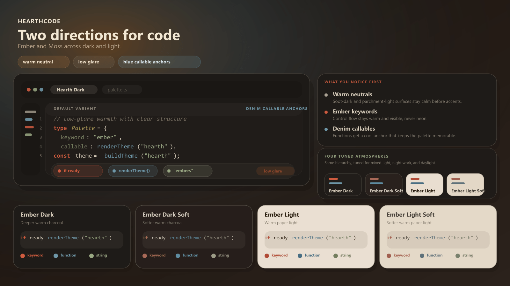

# HearthCode

[English](./README.md) | [简体中文](./README.zh-CN.md) | [日本語](./README.ja.md)

HearthCode 是一套面向代码界面的主题家族。  
目前提供 Ember 和 Moss 两条方向，以及深浅八个主题。

## 快速开始

1. Open VSX 兼容编辑器：<https://open-vsx.org/extension/hearth-code/hearth-theme>
2. VS Code Marketplace：<https://marketplace.visualstudio.com/items?itemName=hearth-code.hearth-theme>
3. VS Code 快速安装：`ext install hearth-code.hearth-theme`
4. Obsidian 主题：<https://github.com/hearth-code/HearthTheme/releases>

## 当前主题

### HearthCode Ember

- `HearthCode Ember Dark`
- `HearthCode Ember Dark Soft`
- `HearthCode Ember Light`
- `HearthCode Ember Light Soft`

### HearthCode Moss

- `HearthCode Moss Dark`
- `HearthCode Moss Dark Soft`
- `HearthCode Moss Light`
- `HearthCode Moss Light Soft`

## 链接

- 网站：<https://theme.hearthcode.dev>
- Open VSX：<https://open-vsx.org/extension/hearth-code/hearth-theme>
- VS Code Marketplace：<https://marketplace.visualstudio.com/items?itemName=hearth-code.hearth-theme>
- Obsidian Releases：<https://github.com/hearth-code/HearthTheme/releases>
- 源码仓库：<https://github.com/hearth-code/HearthTheme>
- 更新日志：<https://github.com/hearth-code/HearthTheme/blob/main/extension/CHANGELOG.md>
- 问题反馈：<https://github.com/hearth-code/HearthTheme/issues>

## 维护者指南

维护流程、发布闸门与源文件真值说明见 [`docs/maintainer.md`](./docs/maintainer.md)。
