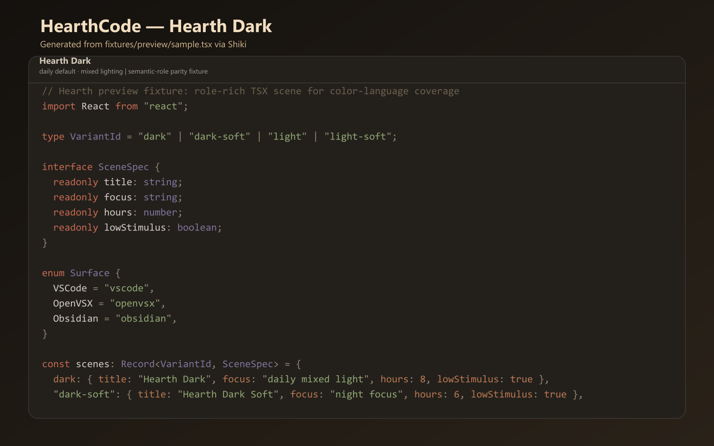
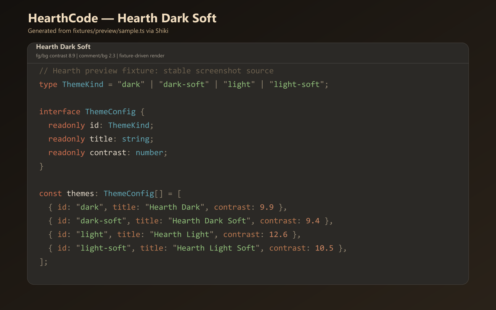
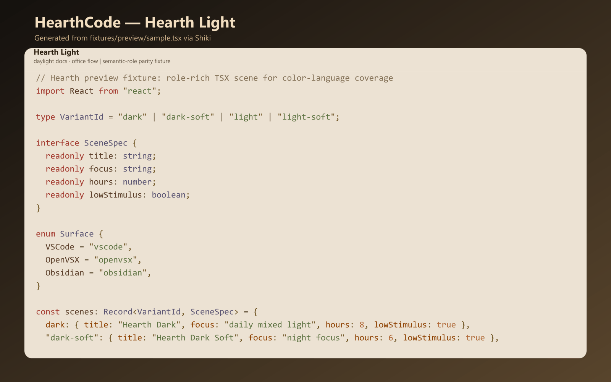
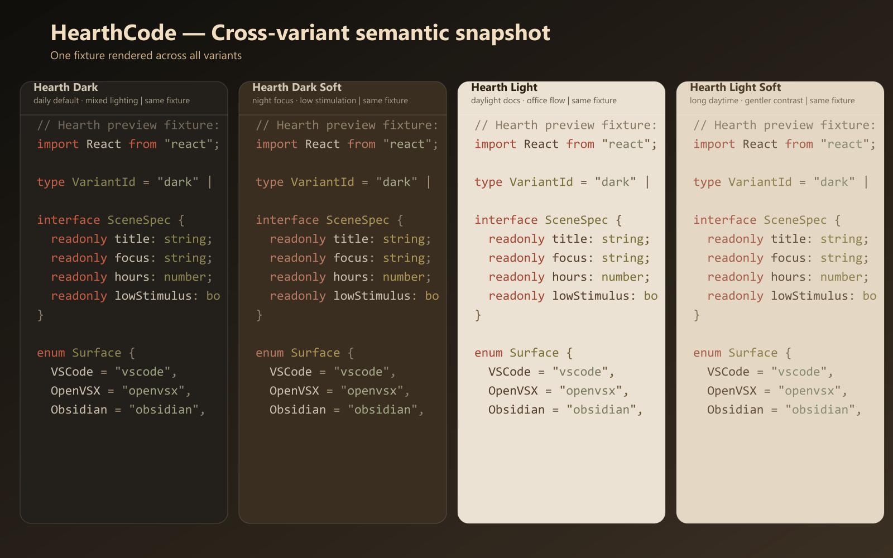

# HearthCode

Code by Hearthlight. 炉光码字。

HearthCode is a warm, low-glare VS Code theme set made for long coding sessions.
If bright themes tire your eyes after a few hours, HearthCode keeps contrast strong while reducing glare and color noise.
Dark and light variants share the same semantic role mapping, so your syntax cues stay stable when switching modes.

## Why Install

- Built for long sessions: warm palette, controlled saturation, lower visual fatigue
- Clear role hierarchy: keywords, functions, strings, and types stay easy to scan
- Cross-mode consistency: Dark, Dark Soft, and Light keep matching token semantics

## Install in 10 Seconds

- Open VS Code Quick Open (`Ctrl+P`)
- Run:

```text
ext install hearth-code.hearth-theme
```

- Marketplace page: <https://marketplace.visualstudio.com/items?itemName=hearth-code.hearth-theme>
- If HearthCode helps your workflow, please leave a rating and star the repo.

## Included Themes

- `Hearth Dark` (default)
- `Hearth Dark Soft`
- `Hearth Light`

## Preview






Preview images are generated from a fixed fixture by script to keep comparisons stable across releases.

## Why HearthCode

- Warm palette with controlled saturation for lower visual fatigue
- Strong role separation for keywords, strings, types, and operators
- Cross-mode semantic consistency between dark and light variants
- Quiet comments/operators tuned for focus stability in long sessions

## Accessibility Snapshot

- Dark editor foreground/background contrast: `9.9`
- Dark Soft editor foreground/background contrast: `9.4`
- Light editor foreground/background contrast: `12.6`
- Comment contrast window: `2.4 - 3.8`

## Links

- Website: <https://theme.hearthcode.dev>
- Source repository: <https://github.com/TypeFusion/HearthTheme>
- Changelog: [CHANGELOG.md](./CHANGELOG.md)

## Note About Marketplace Buttons

If you see share/social-style buttons on the Marketplace page, those are generated by the Marketplace UI itself, not injected by this README.
This README intentionally does not use badge-based social buttons.
